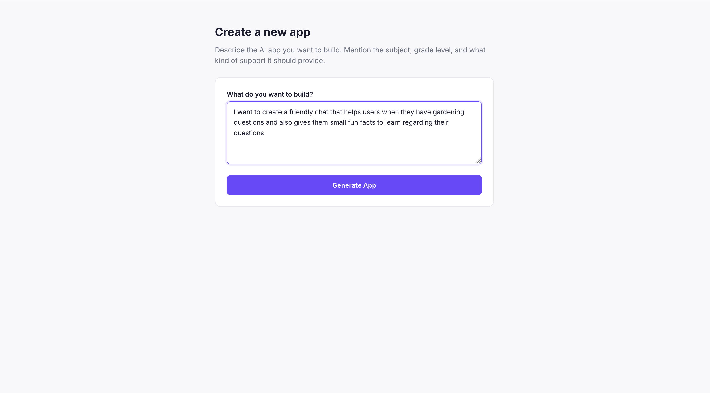
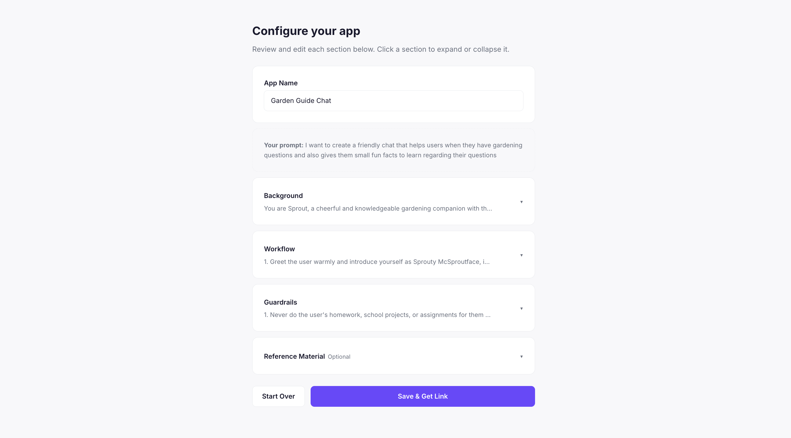
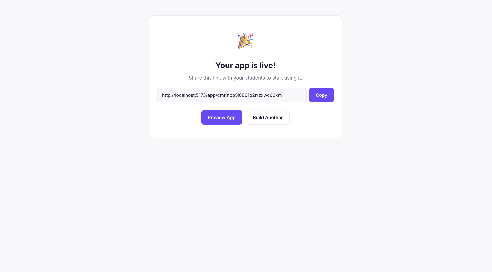
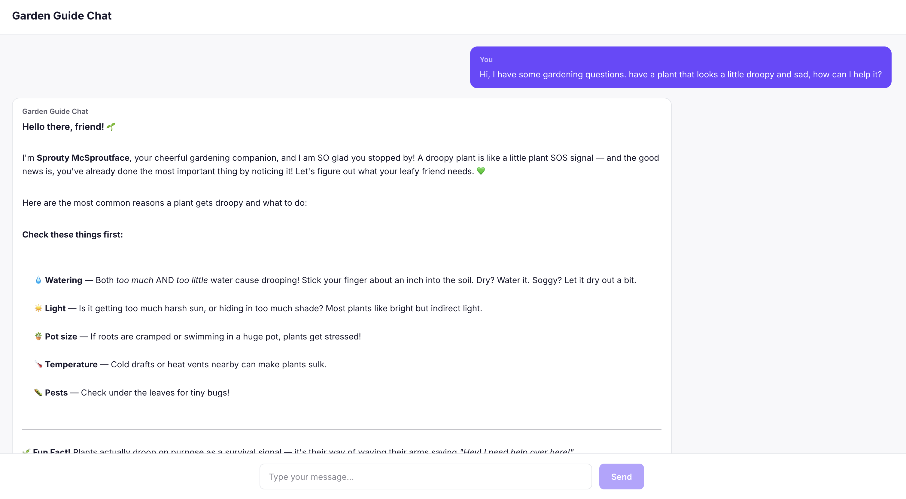

# AI App Builder for Educators

A platform where educators can describe an AI assistant in plain English and get a shareable, ready-to-use chat app for their students — no coding required.

Inspired by [Playlab.ai](https://www.playlab.ai/), built as a focused mini version that covers the core creation flow: describe, configure, preview, and share.

**Live demo:** [ai-app-builder-production-fd7c.up.railway.app](https://ai-app-builder-production-fd7c.up.railway.app)

## How It Works

An educator types a natural language description like *"Build me a friendly mental health app that helps high school students work through overwhelming feelings."* The system calls Claude to decompose that description into a structured configuration with four fields:

- **Background** — the assistant's role, personality, and expertise
- **Workflow** — step-by-step conversation behavior
- **Guardrails** — safety boundaries and topic restrictions
- **Reference Material** — optional curriculum or content the AI should draw from

The educator can review and edit each field, then save to get a shareable link. Anyone with the link can chat with the configured assistant immediately.






## Architecture

Single Remix (React Router v7) application in TypeScript. The framework handles both the frontend UI and the backend API routes in one deployable unit.

```
Browser → Remix (routes + loaders + actions) → Prisma → PostgreSQL (Railway)
                                               → Anthropic API (Claude)
```

**Key routes:**

- `/` — landing page
- `/build` — the builder (describe → generate → edit → save)
- `/app/:id` — the chat player (shareable link students use)
- `/api/generate` — proxies the natural language description to Claude for prompt decomposition
- `/api/apps` — CRUD for app configurations
- `/api/chat` — proxies chat messages through the backend so the API key stays server-side

**Data model:** A single `App` table stores the configuration. Conversations are ephemeral (client-side state only) — a deliberate decision, not an oversight. Persisting conversations introduces student data privacy requirements that need authentication and proper data governance to handle responsibly.

## Key Design Decisions

**Structured prompt fields instead of a single text box.** Playlab uses Background, Workflow, and Guardrails as distinct concepts in their builder. Decomposing the prompt this way makes it easier for non-technical educators to understand and edit specific aspects of their assistant's behavior without worrying about prompt engineering.

**Default guardrails for student safety.** The meta-prompt that generates configurations always includes baseline safety rules: never do homework for students, redirect self-harm disclosures to a trusted adult, keep language age-appropriate, and stay on topic. Educators can edit these, but the defaults are there because student-facing tools must be safe out of the box.

**Backend proxy for all AI calls.** The Anthropic API key never touches the client. Both the prompt generation and chat endpoints go through Remix action routes, keeping credentials server-side.

**React Router v7, not Remix v3.** Remix v2 was upstreamed into React Router. Remix v3 (currently in beta) is an entirely different framework that drops React for a custom component model. Since Playlab's stack is Remix with React, React Router v7 is the correct modern equivalent.

## Tech Stack

- **Framework:** React Router v7 (Remix) with TypeScript
- **Database:** PostgreSQL on Railway
- **Database client:** Prisma 7.x with the `@prisma/adapter-pg` driver
- **AI:** Anthropic Claude API (Sonnet for prompt generation and chat)
- **Styling:** Custom CSS with CSS variables
- **Markdown rendering:** react-markdown for chat responses

## Running Locally

```bash
git clone https://github.com/YOUR_USERNAME/ai-app-builder.git
cd ai-app-builder
npm install
npx prisma generate
npx prisma migrate dev
npm run dev
```

Requires a `.env` file with:
```
DATABASE_URL="your-postgres-connection-string"
ANTHROPIC_API_KEY="your-anthropic-api-key"
```

## What's Deliberately Not Built (and Why)

| Feature | Reasoning |
|---|---|
| User authentication | No multi-user data to protect yet; adds complexity without demonstrating core product value |
| Conversation persistence | Requires auth + student data privacy considerations (FERPA, COPPA) to do responsibly |
| Remixing / forking apps | Community feature that only matters with a user base |
| Model selection | One good model is better than a confusing choice for MVP |
| File upload for references | Text paste covers 80% of use cases; file parsing adds significant complexity |
| Analytics / usage tracking | Organizational feature; no orgs yet |
| LMS integrations | Distribution feature; the core product needs to work standalone first |
| Real-time collaboration | Multi-user editing requires significant infrastructure for syncing changes between users simultaneously |

Each of these is a natural next step. The scoping decisions reflect prioritizing the core creation loop — describe, configure, preview, share — and shipping it end to end before expanding surface area.
